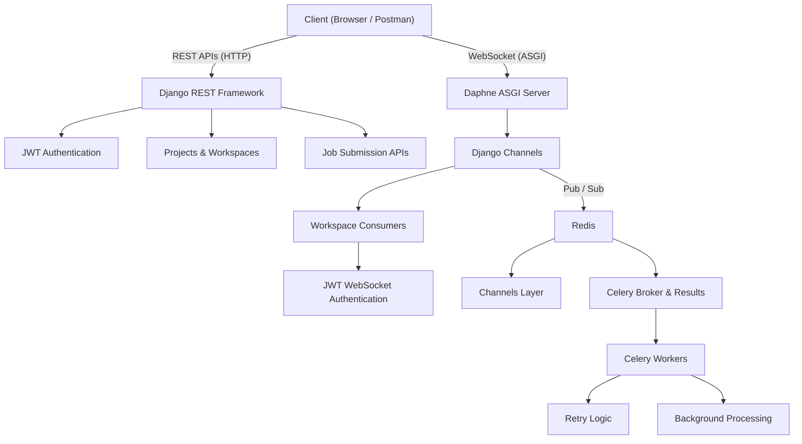

# 🧠 Real-Time Collaborative Workspace Backend

A production-grade backend service for a real-time collaborative developer workspace, built using **Django**, **Django REST Framework**, **Django Channels**, **Redis**, **Celery**, and **JWT-based authentication**.

The system supports:
- Secure authentication
- Project & workspace management
- Real-time collaboration using WebSockets
- Asynchronous background job processing
- Cloud-ready, scalable architecture

---

## 📐 Architecture Diagram


---

## 🧰 Tech Stack

- **Backend**: Django 4.2, Django REST Framework
- **Authentication**: JWT (SimpleJWT)
- **WebSockets**: Django Channels + Daphne
- **Message Broker / Cache**: Redis
- **Async Jobs**: Celery
- **Database**: SQLite (development), PostgreSQL recommended for production
- **API Docs**: Swagger (drf-yasg)
- **Deployment Ready**: Docker-compatible services

---
## 🚀 Quick Start (Docker – Recommended)

This project is fully containerized using Docker Compose.
All required services (Django ASGI + Redis + Celery) start automatically.

### 📦 Prerequisites

- Docker v24+

- Docker Compose v2+

### ▶️ Start the Application
```bash
docker compose up --build
```

This will start:

- Django + Daphne (API & WebSockets) → http://127.0.0.1:8000

- Swagger API Docs → http://127.0.0.1:8000/swagger/

- Redis (broker + pub/sub)

- Celery Worker (background jobs)

### ⏹ Stop Services
```bash
docker compose down
```
### 🔁 Rebuild Containers (after code changes)
```bash
docker compose up --build
```
### 🧪 Verify Everything Is Working
✅ 1. Swagger API

Open:
```bash
http://127.0.0.1:8000/swagger/
```
✅ 2. Authentication
```bash
POST /api/auth/login/
```
✅ 3. WebSocket Test
```bash
const socket = new WebSocket(
  `ws://127.0.0.1:8000/ws/workspaces/1/?token=<JWT_ACCESS_TOKEN>`
);
```
✅ 4. Celery Test Endpoint
```bash
POST /api/jobs/test-celery/
Authorization: Bearer <JWT_ACCESS_TOKEN>
```

Expected:
```bash
{
  "status": "task queued",
  "job_id": "uuid"
}
```
### 🧪 Running Tests

Tests can be executed inside or outside Docker.

Local
```bash
pytest
```
Docker (optional)
```bash
docker compose exec web pytest
```

## 🚀 Setup & Run Instructions(Manual)

### 1️⃣ Prerequisites

- Python **3.10+**
- Redis (Docker recommended)
- Virtual environment support

---

### 2️⃣ Clone Repository & Setup Environment

```bash
git clone <your-repository-url>
cd collab_backend

python -m venv my_env
my_env\Scripts\activate   # Windows
# source my_env/bin/activate  # Linux / macOS

pip install -r requirements.txt

```

### 3️⃣ Start Redis

Using Docker:
```bash

docker run -d -p 6379:6379 redis

```
Verify Redis:
```bash
redis-cli ping
# PONG
```
### 4️⃣ Database Setup
```bash
python manage.py makemigrations
python manage.py migrate
python manage.py createsuperuser
```
### 5️⃣ Start Django (ASGI via Daphne)
```bash
daphne -b 127.0.0.1 -p 8000 collab_backend.asgi:application
```

Note: Daphne is required for reliable WebSocket support.

### 6️⃣ Start Celery Worker

Open a new terminal (activate virtualenv first):
```bash
celery -A collab_backend worker --loglevel=info
```
## 🔐 Authentication (JWT)
Login Endpoint
```bash
POST /api/auth/login/

```

Request Body:
```bash
{
  "email": "user@example.com",
  "password": "password"
}

```
Response:
```bash
{
  "access": "<JWT_ACCESS_TOKEN>",
  "refresh": "<JWT_REFRESH_TOKEN>"
}

```
Use the access token for all authenticated APIs.

## 📁 Project & Workspace APIs

- Create, update, delete projects

- Manage workspaces

- Assign roles (Owner / Collaborator / Viewer)

- Protected using JWT & role-based permissions

## 📘 API Documentation

This project uses **Swagger UI (drf-yasg)** to provide interactive, self-documenting REST APIs.

Swagger allows you to:
- Explore all available endpoints
- Authenticate using JWT Bearer tokens
- Execute API requests directly from the browser
- Validate request/response schemas

Swagger UI:
Once the server is running, open:
```bash

http://127.0.0.1:8000/swagger/
```

---

## 🔐 Authentication in Swagger (JWT Bearer)

### Step 1: Generate JWT Token

Use the **Login API**:

**Endpoint**
```bash

POST /api/auth/login/
```

**Request Body**
```json
{
  "email": "user@example.com",
  "password": "password"
}
```
Response
```json
{
  "access": "<JWT_ACCESS_TOKEN>",
  "refresh": "<JWT_REFRESH_TOKEN>"
}
```
Step 2: Authorize in Swagger UI

-Click the Authorize 🔓 button (top-right)

-In the Bearer field, enter:
```json
Bearer <JWT_ACCESS_TOKEN>
```
-Click Authorize

-Close the popup

All protected APIs are now authenticated.

## 📁 Project & Workspace APIs (Swagger)
- Create Project

- Swagger Path
```bash
POST /api/projects/projects/
```

- Request Body
```bash
{
  "name": "My Project",
  "description": "Demo project"
}
```

- Expected Response
```bash
{
  "id": 1,
  "name": "My Project",
  "description": "Demo project",
  "created_at": "2025-12-26T17:23:38Z",
  "owner": 2
}
```
#### List Projects

Swagger Path
```bash
GET /api/projects/projects/

```
Returns all projects owned or accessible by the authenticated user.

#### Update Project

Swagger Path
```bash
PUT /api/projects/projects/{project_id}/

```
Modify project name or description.

#### Delete Project

Swagger Path
```bash
DELETE /api/projects/projects/{project_id}/
```

Deletes a project (Owner only).

### ⚙️ Job APIs (Swagger + Celery)
#### Submit Background Job

Swagger Path
```bash
POST /api/jobs/submit/
```

Request Body
```bash
{
  "code": "print('Hello World')",
  "language": "python"
}
```

Response
```
{
  "message": "Job queued",
  "job_id": "job_123"
}
```
### 🔴 Real-Time Collaboration (WebSockets)
WebSocket Endpoint
```bash
ws://127.0.0.1:8000/ws/workspaces/<workspace_id>/?token=<JWT_ACCESS_TOKEN>
```
### Authentication

- JWT is passed during WebSocket handshake

- Custom middleware validates token and attaches user to scope

### 🧪 WebSocket Testing (Browser Console)

Open Chrome DevTools → Console and run:
```bash
const token = "<JWT_ACCESS_TOKEN>";

const socket = new WebSocket(
  `ws://127.0.0.1:8000/ws/workspaces/1/?token=${token}`
);

socket.onopen = () => {
  console.log("✅ WebSocket Connected");

  socket.send(JSON.stringify({
    event: "ping",
    payload: { msg: "hello from browser" }
  }));
};

socket.onmessage = (e) => {
  console.log("📩 Message:", JSON.parse(e.data));
};

socket.onerror = (e) => {
  console.error("❌ WebSocket error", e);
};
```
Expected Output
```bash
✅ CONNECTED
📩 MESSAGE RECEIVED: {
  event: "file_change",
  payload: {...},
  user: "user@example.com"
}
```

## ⚙️ Asynchronous Job Processing (Celery)

The system supports asynchronous background job execution using Celery with Redis as both the broker and result backend. This allows long-running or compute-heavy tasks to be processed outside the request–response lifecycle.

### 🧩 Architecture Overview

- API Layer: Accepts job requests via REST

- Message Broker: Redis queues tasks

- Worker Layer: Celery workers execute tasks asynchronously

- Resilience: Automatic retries for transient failures

### 🔁 Job Submission API
```bash
POST /api/jobs/submit/
Authorization: Bearer <JWT_ACCESS_TOKEN>
```

Request Body
```bash
{
  "code": "print('Hello World')",
  "language": "python"
}
```

#### Behavior

- The request returns immediately

- Job is pushed to Redis

- Celery worker processes the task asynchronously

- Results are logged and can be persisted if required

### 🧪 Celery Health & Test Endpoint

A dedicated endpoint is provided to validate Celery + Redis connectivity in all environments (local, Docker, CI).
```bash
POST /api/jobs/test-celery/
Authorization: Bearer <JWT_ACCESS_TOKEN>
```

Request Body
```bash
{}
```

#### Purpose

- Confirms Redis broker availability

- Confirms Celery worker is running

- Confirms async task execution pipeline

- Useful for smoke tests and deployments

Expected Response
```bash
{
  "status": "task queued",
  "job_id": "xxxxxxxx-xxxx-xxxx-xxxx-xxxxxxxxxxxx"
}
```
### 🔄 Background Processing Flow

- Client sends request to API

- API enqueues task to Redis

- Celery worker consumes task

- Task executes asynchronously

- Result is logged / persisted

- Client is not blocked at any stage

### 🔁 Retry & Failure Handling

Celery tasks implement automatic retry logic to handle transient failures.
```bash
@shared_task(bind=True, max_retries=3)
```

#### Retry Strategy

- Up to 3 retries

- Configurable delay between retries

- Prevents cascading failures

- Safe for idempotent execution

### 🧪 How to Test (Docker / Local)
1️⃣ Ensure Services Are Running
```bash
docker compose up --build
```
2️⃣ Verify Celery Worker Logs
```bash
docker logs collab_backend-celery-1
```
3️⃣ Trigger Test Task
```bash
POST http://127.0.0.1:8000/api/jobs/test-celery/
Authorization: Bearer <JWT_ACCESS_TOKEN>
```
4️⃣ Observe Worker Execution

Celery logs will show:

- Task received

- Task executed

- Retry behavior (if simulated failure occurs)
- 
### 🎯 Why This Design?
| Decision                | Reason                             |
| ----------------------- | ---------------------------------- |
| Celery                  | Industry-standard async processing |
| Redis                   | Fast, reliable broker + pub/sub    |
| Async tasks             | Prevent API blocking               |
| Retries                 | Fault tolerance                    |
| Dedicated test endpoint | Deployment safety & observability  |

### 📈 Scalability Considerations

- Multiple Celery workers can be added horizontally

- Redis supports high-throughput task queues

- Tasks are stateless and idempotent

- No tight coupling between API and worker layers

### Test Execution

```bash
pytest
```
## 🧪 Testing Summary

| Feature         | How to Test                  |
| --------------- | ---------------------------- |
| Authentication  | Postman → `/api/auth/login/` |
| REST APIs       | Swagger UI / Postman         |
| WebSockets      | Browser Console              |
| Background Jobs | Postman + Celery logs        |
| Retries         | Simulated task failures      |
| Rate Limiting   | Exceed request thresholds    |


## 🚀 Deployment Instructions

This project is designed to be cloud-ready and horizontally scalable.

### 🔧 Local Development Deployment

#### Required Services:

- Django (ASGI)

- Redis

- Celery Worker

#### Run Order:

- Start Redis

- Start Django via Daphne

- Start Celery worker
```bash
docker run -d -p 6379:6379 redis
daphne -b 0.0.0.0 -p 8000 collab_backend.asgi:application
celery -A collab_backend worker --loglevel=info

```
### ☁️ Production Deployment (Recommended)

#### Suggested Stack:

- ASGI Server: Daphne / Uvicorn

- Reverse Proxy: Nginx

- Database: PostgreSQL

- Cache & Broker: Redis

- Workers: Multiple Celery workers

#### Production Notes:

- Replace SQLite with PostgreSQL

- Store secrets using environment variables

- Enable HTTPS (WSS for WebSockets)

- Use process manager (systemd / supervisor)

- Scale Daphne & Celery independently

### 🐳 Docker Deployment (Optional)

#### Services can be containerized using:

- Django + Daphne container

- Redis container

- Celery worker container

#### This enables:

- Horizontal scaling

- CI/CD integration

- Cloud deployment (AWS / GCP / Azure)


## ⚖️ Design Decisions & Trade-offs
### Django + Channels

-Unified backend ecosystem

- Native ASGI support

- Clean WebSocket integration

### Daphne

- Reliable ASGI server

- Stable WebSocket handling on Windows

- Production-ready

### Redis

- Channel layer pub/sub

- Celery broker & result backend

- Enables horizontal scaling

### SQLite

- Fast local development

#### PostgreSQL recommended for production environments

## 📈 Scalability Considerations

- Horizontal scaling via Redis channel layers

- Stateless WebSocket consumers

- Multiple Daphne instances behind load balancer

- Independent Celery worker scaling

- JWT-based auth (no session stickiness)

- Database can be upgraded to PostgreSQL/MySQL

## 🔍 Security & Observability

- JWT expiration & refresh flow

- Input validation via serializers

- ORM-based SQL injection protection

- API rate limiting (DRF throttles)

- Environment-based secrets

- Structured logging

## 🏁 Conclusion

This backend demonstrates a production-grade architecture with real-time communication, async processing, and secure APIs.
All major features were tested locally using Daphne, Redis, Celery workers, Swagger, Postman, and browser-based WebSocket clients.

## ✅ Submission Checklist

- [x] REST APIs with Swagger documentation
- [x] JWT authentication & authorization
- [x] WebSocket real-time collaboration
- [x] Redis pub/sub integration
- [x] Celery background processing with retries
- [x] Dockerized local & production setup
- [x] Unit & integration tests
- [x] Scalable architecture design

